# イライラ棒動作システム for RaspberryPi

Pythonプログラムであるが音声出力でLinux依存部分があるため、Linux (RaspberryPi OS)上の動作を前提とする。

## 設計

### システム構成



### 画面遷移



## 動作方法

### Python環境の構築

### Python環境にpoetryをインストールする

```shell
python -m pip install poetry
```

### ライブラリのインストール

poetryがインストールされたPython環境下で環境構築する。 pyproject.tomlがあるディレクトリで実行する。

```shell
python -m poetry install --no-dev
```

### アプリの実行

```shell
python -m poetry python src/iraira
```

### 開発

開発時は開発用ライブラリもインストールする

```shell
python -m poetry install --no-dev
```

#### WSL環境 (Ubuntu22.04)

Qt動作

* [libegl1](https://packages.ubuntu.com/bionic/libegl1)のインストール`sudo apt libegl1`が必要
* 日本語フォントがないため追加インストール `sudo apt install fonts-noto-cjk`
